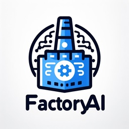

# Factory App AI (Coming Soon)

Factory App AI is an innovative program designed to generate custom Gradio applications in a streamlined and automated way. This new version leverages state-of-the-art AI technologies to create Docker containers that encapsulate fully functional Gradio applications based on user-provided prompts. The goal is to simplify and accelerate app development while maintaining flexibility for customization.

While the generated applications are powerful, some human intervention may still be required to refine and finalize certain functionalities.

---

## Features (Coming Soon)

- **Custom Gradio App Generation**: Generate tailored Gradio applications from user prompts.
- **Docker Integration**: Automatically create and deploy Gradio apps within Docker containers for scalability and ease of use.
- **AI-Driven Workflow**: Utilize advanced generative AI models to create interactive applications.
- **Streamlined Development**: Reduce development time and complexity with an automated workflow.

---

## Stay Tuned!

This exciting new version of Factory App AI is coming soon. Follow updates and announcements for its release.

For more information, visit [ruslanmv.com](https://ruslanmv.com).

